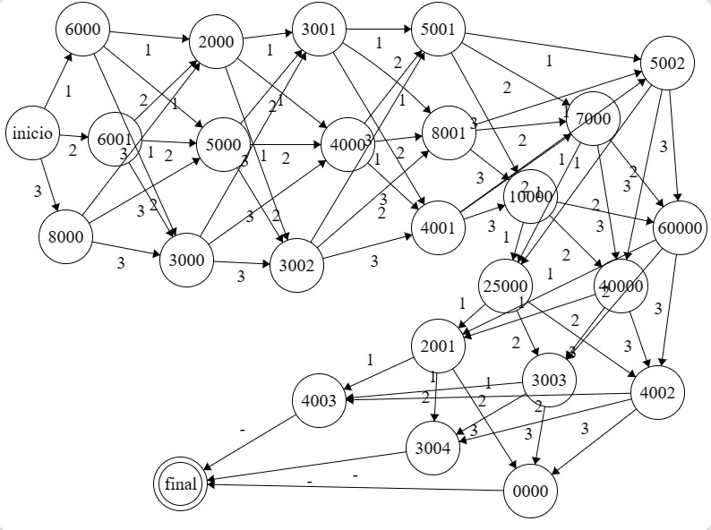

# Purple Place Bakery Automaton

El siguiente repositorio contiene los recursos utilizados durante la elaboración del proyecto _Purple Place Bakery Automaton_. Entre los recursos se encuentra:

### Recursos
- Presentación del equipo y planteamiento del problema.
- Presentación
- Diagrama de transiciones y definición formal del autómata
- Implementación del autómata
- Video

## Introduccion

La teoría de autómatas y lenguajes formales es un campo multidisciplinar cuya importancia en la actualidad no se puede obviar. En el siguiente proyecto se aplica los temas vistos en el curso para la implementación de una máquina que permita calcular el precio de un pastel que contiene determinadas características. \\

Dentro de las características a evaluar se tiene: Tamaño, relleno, cobertura, decoración, sabor bizcocho, forma, textura y adicionales. \\

En las siguientes diapositivas se presenta la propuesta planteada para abordar el problema, junto con los resultados de dicha implementacion.

## Definicion Formal

$$ AFD = (\Sigma, Q, \delta, q_0, F)$$

$$ \Sigma = \\{-, 1, 2, 3\\}$$

$$Q = \\{inicio,6000, 6001, 8000,2000, 5000, 3000, 3001, 4000, 3002, 5001, 8001, 4001, 5002,$$

$$7000, 10000, 25000, 40000, 60000, 2001, 3003, 4002,4003, 3004, 0000,Final\\}$$

$$q_0 = \\{inicio\\}$$

$$F = \\{Final\\}$$

## Diagrama de Transiciones y Funcion de Transferencia

